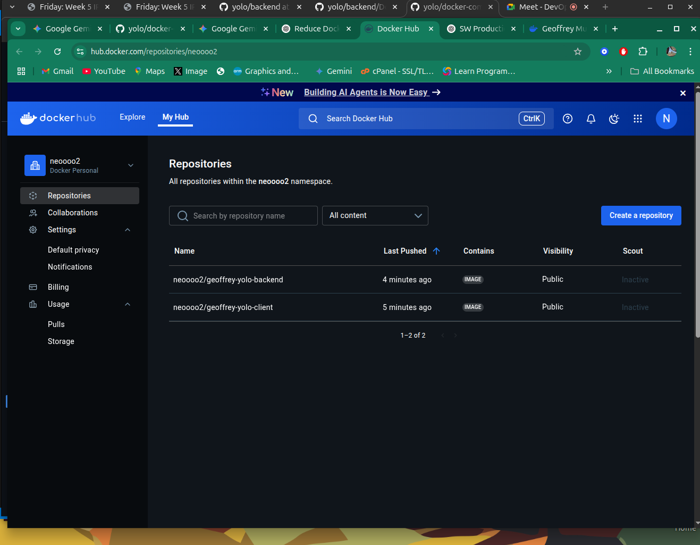
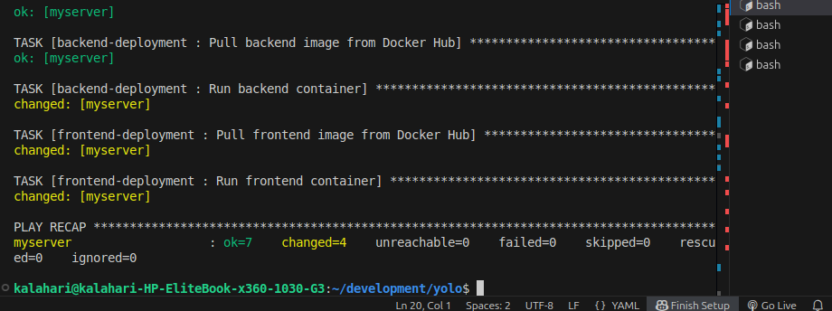

# Geoffrey Murira – IP2 (Yolo Ecommerce Application)

## 📦 Prerequisites

To run this project, ensure you have the following installed:

- **Node.js** (v20 or higher) – for local setup
- **MongoDB** (v6.0 or higher) – for local setup
- **Docker** (v20.10 or higher) – for containerized setup
- **Docker Compose** (v2.0 or higher) – for orchestration
- **Git** – to clone the repository

---

## 🛠️ Tech Stack

| Component     | Technology Used         |
|--------------|--------------------------|
| Frontend      | React (served via NGINX) |
| Backend       | Node.js (Express API)    |
| Database      | MongoDB                  |
| Containerization | Docker & Docker Compose |

---

## 🚀 Features

- React frontend served through NGINX
- Node.js backend API with Express
- MongoDB containerized and persisted with Docker volumes
- Custom Docker bridge network for container communication
- Versioned Docker images pushed to Docker Hub

---

## ⚙️ Setup & Running the Application

### 1. Clone the repository:

```bash
git clone https://github.com/your-username/yolo.git
cd yolo


# Build and run all containers
docker-compose up --build

🔗 Docker Hub Repositories(https://hub.docker.com/repositories/neoooo2)
geoffrey-yolo-client

geoffrey-yolo-backend




🐳 How to Pull from Docker Hub
If you'd like to run the application using pre-built images from Docker Hub:

bash
Copy
Edit
# Pull the backend image
docker pull neoooo2/geoffrey-yolo-backend:v1.0.0

# Pull the frontend image
docker pull neoooo2/geoffrey-yolo-client:v1.0.0
Update your docker-compose.yaml file to remove the build: lines under each service and ensure image: is correctly set like this:

yaml
Copy
Edit
geoffrey-yolo-client:
  image: neoooo2/geoffrey-yolo-client:v1.0.0
  ...

geoffrey-yolo-backend:
  image: neoooo2/geoffrey-yolo-backend:v1.0.0
  ...
Then run:

bash
Copy
Edit
docker-compose up


👤 Author
Geoffrey Murira

DockerHub Profile(neoooo2)
GitHub Profile
Nairobi, Kenya 🇰🇪

# Yolo App Infrastructure Deployment

This project uses **Ansible** to automate deployment of a full-stack e-commerce application (code-named `yolo`) consisting of:

-Frontend: React (`neoooo2/geoffrey-yolo-client:v1.0.0`)
-Backend: Node.js (`neoooo2/geoffrey-yolo-backend:v1.0.0`)
-Database: MongoDB
- Docker for containerization

---

## 📦 Project Structure

tree
.
├── ansible.yml
├── backend
│   ├── Dockerfile
│   ├── models
│   │   └── Products.js
│   ├── package.json
│   ├── package-lock.json
│   ├── routes
│   │   └── api
│   │       └── productRoute.js
│   ├── server.js
│   └── upload.js
├── backend-deployment.yaml
├── client
│   ├── Dockerfile
│   ├── nginx.conf
│   ├── package.json
│   ├── package-lock.json
│   ├── public
│   │   ├── favicon.ico
│   │   ├── index.html
│   │   ├── logo192.png
│   │   ├── logo512.png
│   │   ├── manifest.json
│   │   └── robots.txt
│   ├── README.md
│   └── src
│       ├── App.css
│       ├── App.test.js
│       ├── components
│       │   ├── AboutUs.js
│       │   ├── AddProduct.js
│       │   ├── App.js
│       │   ├── EditProductForm.js
│       │   ├── Footer.js
│       │   ├── Header.js
│       │   ├── Navbar.js
│       │   ├── NewProductForm.js
│       │   ├── ProductControl.js
│       │   ├── ProductDetail.js
│       │   ├── Product.js
│       │   ├── ProductList.js
│       │   └── ReusableForm.js
│       ├── images
│       │   ├── backgrounds
│       │   │   ├── about.jpg
│       │   │   └── hero.jpg
│       │   ├── logo
│       │   │   ├── logo.png
│       │   │   └── shop.png
│       │   ├── mouse_click.png
│       │   ├── product_image.jpeg
│       │   ├── products
│       │   │   ├── backpack.png
│       │   │   ├── giacket.png
│       │   │   ├── pants.png
│       │   │   ├── trekkingshoes.png
│       │   │   ├── tshirt_ladies.png
│       │   │   └── tshirt.png
│       │   └── social_icons
│       │       ├── facebook.png
│       │       ├── flickr.png
│       │       ├── g_plus.png
│       │       ├── pinterest.png
│       │       ├── skype.png
│       │       ├── stumble_upon.png
│       │       ├── twitter_bird.png
│       │       ├── twitter.png
│       │       └── you_tube.png
│       ├── index.js
│       ├── product-detail.css
│       ├── serviceWorker.js
│       └── setupTests.js
├── docker-compose.yaml
├── dockerhub-screenshot.png
├── explanation.md
├── file
├── frontend-deployment.yaml
├── hosts
├── image.png
├── inventory.yml
├── package-lock.json
├── playbook.yml
├── README.md
├── roles
│   ├── backend-deployment
│   │   └── tasks
│   │       └── main.yml
│   ├── docker-network
│   │   └── tasks
│   │       └── main.yml
│   ├── frontend-deployment
│   │   └── tasks
│   │       └── main.yml
│   └── setup-mongodb
│       └── tasks
│           └── main.yml
├── Structure
└── Vagrantfile

23 directories, 77 files

## ⚙️ Prerequisites

Make sure the target server or Vagrant box has:
- Docker installed
- Ansible installed locally (on your host machine)
- Your Ansible inventory is correctly configured
- geerlingguy/ubuntu2004 (virtualbox, 1.0.4) 📦 **Base Vagrant Box**  
[geerlingguy/ubuntu2004 on HashiCorp Cloud](https://portal.cloud.hashicorp.com/vagrant/discover/geerlingguy/ubuntu2004)
- vagrant


## 🚀 Deployment Steps

1. **Clone this repository**
   ```bash
   git clone <your-repo-url>
   cd yolo

    Run the Ansible Playbook

ansible-playbook -i inventory.yml playbook.yml


