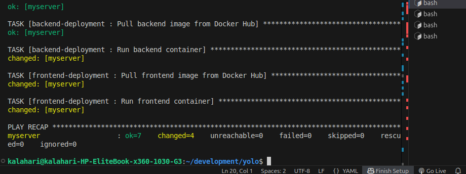
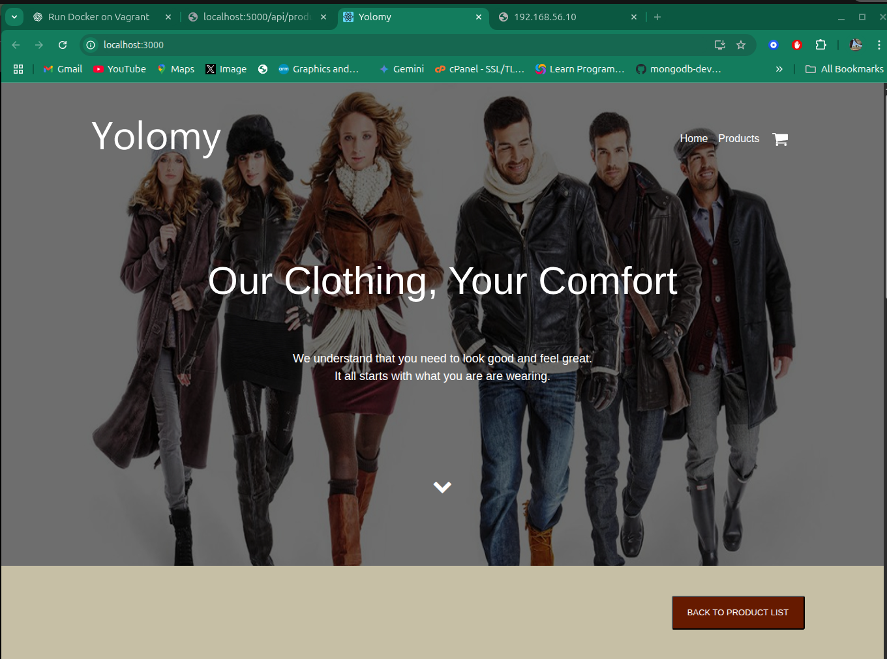
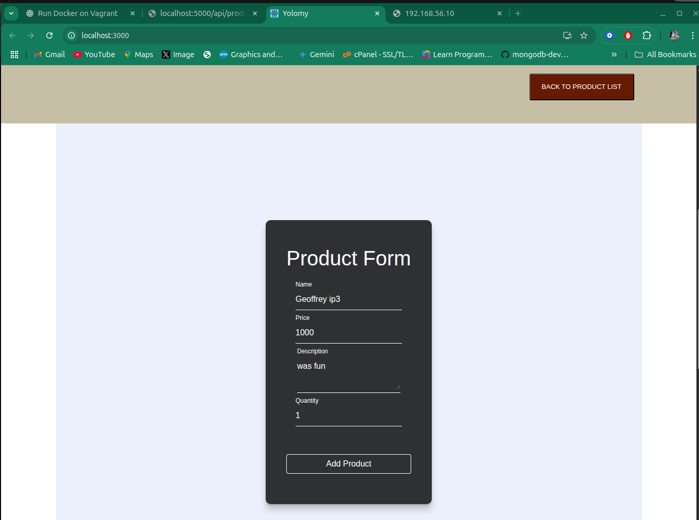
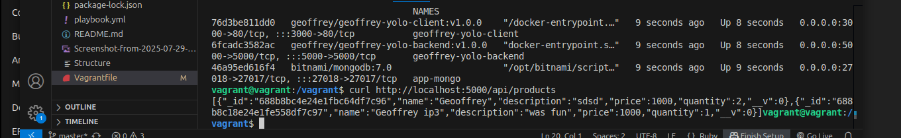
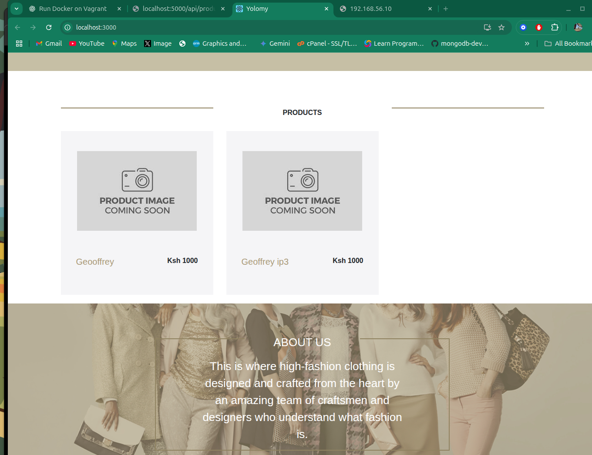

# Yolo App Infrastructure Deployment

This project uses **Ansible** to automate deployment of a full-stack e-commerce application (code-named `yolo`) consisting of:

-Frontend: React (`neoooo2/geoffrey-yolo-client:v1.0.0`)
-Backend: Node.js (`neoooo2/geoffrey-yolo-backend:v1.0.0`)
-Database: MongoDB
-Docker for containerization
-Vagrant to manage provision VMs
-Ansible for automatic configuration and deployment_

---
##  Prerequisites
Ensure you have installed:

- **Vagrant**

- **VirtualBox**

- **Ansible**

<pre>
sudo apt update
sudo apt install software-properties-common
sudo add-apt-repository --yes --update ppa:ansible/ansible 
sudo apt install ansible -y  
ansible --version
</pre>

<pre> bash # Initialize the geerlingguy/ubuntu2004 Vagrant box vagrant init geerlingguy/ubuntu2004 # Start and provision the Vagrant environment vagrant up</pre>
- vagrant, to install vagrant
!
<pre>sudo apt get update</pre>
<pre>sudo apt install vagrant</pre>

Ensure that it is installed
<pre>vagrant --version</pre>

## Why Use Ansible in This Project?
In this project, Ansible is used to automate the deployment of the full-stack yolo e-commerce application inside a Vagrant-provisioned Ubuntu 20.04 virtual machine. It eliminates the need for manual setup by:

Installing required software (like Docker and Docker Compose)

Pulling Docker images from Docker Hub

Setting up and running containers for the backend, frontend, and MongoDB

Ensuring idempotent infrastructure setup — repeatable and consistent

## Ansible Project Structure.

Inventoty -Defines the VM as a remote host (default)

'''
all:
  hosts:
    default:
      ansible_host: 127.0.0.1
      ansible_port: 2222
      ansible_user: vagrant
      ansible_private_key_file: .vagrant/machines/default/virtualbox/private_key

'''

## Playbook:
This is your main instruction file. It lists tasks that Ansible should run on the hosts listed in the inventory.

<pre>
---
- name: Deploy Yolo App Infrastructure
  hosts: all
  become: true

  vars:
    node_app_directory: /home/vagrant/ecommerce-backend
    react_app_directory: /home/vagrant/ecommerce-frontend

  pre_tasks:
    - name: Create app-net Docker network
      docker_network:
        name: app-net
      become: yes

  roles:
    - setup-mongodb
    - backend-deployment
    - frontend-deployment

</pre>

## Roles
  The "How to Do It"
Roles are a modular way to organize your tasks. Each role is like a mini playbook focused on one part of the setup.

'''
roles/
├── setup-mongodb/
│   └── tasks/main.yml
├── backend-deployment/
│   └── tasks/main.yml
└── frontend-deployment/
    └── tasks/main.yml

'''

## The ansible.cfg 
    File is the configuration file for Ansible. It tells Ansible how to behave globally
<pre>
[defaults]
inventory = inventory.yml
host_key_checking = False
retry_files_enabled = False
roles_path = ./roles
remote_user = vagrant
private_key_file = .vagrant/machines/default/virtualbox/private_key
</pre>

**Runnning the Ansible Playbook**

<pre>ansible-playbook -i inventory.yml playbook.yml</pre>

Use Vagrant to manage your Virtual Machines.
<pre> Vagrant Up</pre>

Gain acces to your Vagrant VM
<pre> Vagrant ssh </pre>

Once you have access build you project locally in the terminal
<pre> docker-compose build </pre>
<pre> docker-compose up -d </pre>

The application is now up and running, inside your host machine thanks to port forwading in the
vagrant file
<pre> # Correct forwarded ports
  config.vm.network "forwarded_port", guest: 3000, host: 3000   # React frontend
  config.vm.network "forwarded_port", guest: 5000, host: 5000   # Node backend
  config.vm.network "forwarded_port", guest: 27017, host: 27017 # MongoDB
</pre>

Navigate to your local browser at
<pre> http://localhost:3000 </pre>

Add products to the application, to ensure functionality is working.

USe curl to see if the backend received the new data succesfully

Congratulations your appilcation is you application is now up and running inside your Vagrant VM(Virtual Machine)

To stop the apllication, run
<pre> docker-compose down </pre>

exit from your vagrant machine
<pre> exit </pre>
Stop the vagrant machine
<pre> vagrant halt </pre>